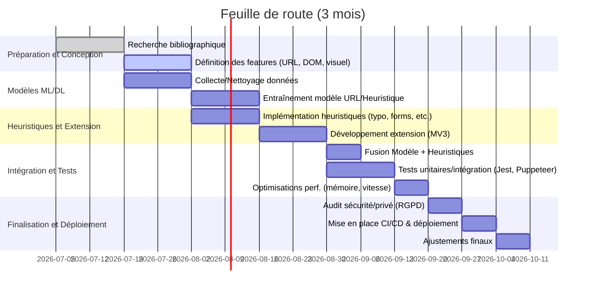

# Résumé exécutif  
La détection en temps réel de sites de **phishing** dans le navigateur s’appuie aujourd’hui sur des approches hybrides mêlant apprentissage automatique et règles heuristiques. Les travaux récents (2021–2026) montrent qu’il faut combiner l’analyse des URL, du contenu DOM/CSS et des signaux visuels pour atteindre une détection fiable. Par exemple, Dandotiya *et al.* (2026) proposent une extension Chrome qui recueille des **features hybrides** (lexicales, structurelles, visuelles) et utilise une combinaison SVM/Arbre de décision/Forêt aléatoire optimisée par un Grey Wolf Optimizer, obtenant un MCC de 0.96 (précision 98,7 %). Des solutions plus **dynamiques** exploitent des réseaux de neurones profonds (BiLSTM avec attention), voire des Transformer (RoBERTa pour e-mails, ~98,5 % précision) ou des GNN sur les graphes HTML (HUGPhish, F1≈90,9 %). Les systèmes embarqués modernes intègrent aussi des **composantes d’explicabilité** (LIME/SHAP+LLM) et tirent parti de flux d’intelligence sur les menaces (bases PhishTank, Safe Browsing, etc.) en local ou fédéré.  

Sur le plan pratique, une détection temps réel doit impérativement se greffer au navigateur (Manifest V3) : cela implique des *content scripts* pour extraire DOM, formulaires, etc., et des API Web (pour écouter les requêtes) tout en respectant les limites de MV3 (suppression de `webRequestBlocking`, obligation de `declarativeNetRequest` pour règles statiques, impossibilité d’intercepter les champs de mot de passe). L’architecture typique est donc hybride : analyse *on-device* pour la rapidité et la vie privée, complétée par des mises à jour périodiques de modèles et listes noires.  

Ce rapport détaille les techniques SOTA en académiqu (articles clefs, depuis 2021), les approches ML/DL avancées (transformers, GNN, etc.), les heuristiques (typosquatting, homographes, etc.), les signaux du navigateur disponibles sous V3, les intégrations d’intel (caches locaux, Bloom filters, FL), la conception d’un moteur de risque / scoring explicable, les métriques et jeux de tests recommandés, les stratégies d’évasion et leurs contremesures, ainsi qu’une architecture de déploiement d’extension Chrome (mode hors-ligne, cache, CI/CD, télémétrie minimale). Un plan d’implémentation détaillé (TypeScript/MV3), les bibliothèques clés, exemples de code et tests (unitaires, E2E, fuzzing) sont fournis. Des tableaux comparent les méthodes (précision, latence, mémoire, robustesse, explicabilité) et une feuille de route Mermaid présente un calendrier sur 3 mois. Les compromis, limites et enjeux juridiques/privés (RGPD, etc.) sont explicitement discutés.  

## 1. État de l’art académique (dernières années)  
Les publications récentes insistent sur la détection **multifacette** : combiner signaux d’URL, de contenu et d’apparence. Par exemple, Dandotiya *et al.* (Scientific Reports 2026) présentent un cadre d’extension Chrome qui capture des paramètres lexicaux (URL), structurels (DOM, styles CSS) et visuels (layout des blocs, logos) et les classe avec SVM/DT/Forêt aléatoire optimisée par Grey Wolf. Ils rapportent une MCC=0.96 (accuracy=98.7 %). De même, PhishingRTDS (2024, *Computers & Security*) utilise un BiLSTM avec attention sur les URL et un conteneur Docker pour extraire dynamiquement tous les liens d’une page. Chaque lien est évalué par le modèle et trois stratégies de fusion (score unique, moyenne, moyenne pondérée) déterminent le verdict global; la moyenne pondérée (WeAS) donne les meilleurs résultats. Ces travaux illustrent l’efficacité des modèles profonds pour le texte (BILSTM, Transformers) et la nécessité de stratégies **de fusion** adaptées.  

La littérature souligne aussi l’émergence des **ensembles (ensembles learning)** et de modèles hybrides : EXPLICATE (2025, arXiv) combine un classifieur ML sur features métiers avec une double couche explicative (LIME+SHAP) puis un LLM pour produire des explications en langage clair. Ce système atteint 98.4 % de précision tout en fournissant des justifications intelligibles. L’étude HUGPhish (ICCCI 2025) intègre l’extraction de n-grammes d’URL, des features HTML manuel et un graphe HTML passé dans un GNN ; un classifieur final (LightGBM) atteint un F1=90.92 %, montrant l’intérêt des graphes de DOM. Enfin, des surveys sur le phishing (voir par ex. Wilk-Jakubowski *et al.*, MDPI 2025) confirment que les approches SOTA mêlent apprentissages de représentations avancées (transformers, contrastive learning) et heuristiques déterministes. Une méta-analyse récente recommande d’utiliser des métriques robustes (PR-AUC, MCC) plutôt que la seule précision, et de bien valider sur plusieurs datasets (PhishTank, Alexa, etc.).  

### Sources et références clé  
- **Dandotiya et al. (2026)** – *Real-time identification of phishing... (Scientific Reports)* : Extension Chrome hybride (SVM/DT/RF + GWO), 98.7 % précision.  
- **Asiri et al. (2024)** – *PhishingRTDS* : Modèle BiLSTM+attention, navigateur et conteneur, 99 % de précision sur URL.  
- **NoPhish (Thaqi et al., arXiv 2024)** : Extension Chrome avec pipeline ML (encore à détailler).  
- **HUGPhish (Vuong et al., ICCCI 2025)** : GNN sur graphe HTML + LightGBM, F1≈90.9 %.  
- **EXPLICATE (Zaware et al., 2025)** : Système explicable (LIME/SHAP+LLM) avec ~98.4 % d’exactitude.  
- **FedPhishLLM (et al., 2026)** : Détection fédérée et LLM (privacy-preserving) pour éviter collecte centralisée.  
- Surveys récents (2022–2025) : par ex. Madhukumar et al., MDPI ou Liang et al., IEEE, couvrent URL+HTML+visuel.  

Ces travaux couvrent les thèmes d’apprentissages (SVM, RF, DL, Transformers, GNN, etc.) ainsi que l’intégration d’heuristiques (features statiques) et de moteurs d’explication.  

## 2. Approches ML/DL avancées  
Les approches récentes exploitent tout l’éventail du machine learning et deep learning.  

- **Transformers / LLMs** : utilisés pour analyser le contenu textuel ou contextuel. Par exemple, Amaz Uddin *et al.* (2026) ont fine-tuné un RoBERTa pour la détection de *phishing par email*, obtenant 98,45 % de précision. L’architecture transforme les emails en embeddings, une classification finale suivie d’explication LITA (LIME+Transformers Interpret) fournit un modèle interprétable. Pour les pages web, on peut envisager d’analyser le texte visible (titres, labels de boutons) par un transformer ou même des modèles multimodaux (texte+images).  

- **Auto-supervisé / Contrastive Learning** : Apprendre des représentations d’URL ou d’éléments de page sans labels peut améliorer la détection des comportements anormaux. Bien que peu documentées spécifiquement pour le phishing, ces méthodes (SimCLR, BYOL, etc.) ont été utilisées dans la cybersécurité pour généraliser sur de nouveaux patterns.  

- **Graph Neural Networks (GNN)** : modéliser les pages web comme graphes (noeuds=balises HTML ou ressources, arêtes=liens/DOM) a démontré son efficacité. HUGPhish convertit le contenu HTML en graphe et utilise un GNN pour en extraire un embedding, fusionné à des features classiques. PhishGNN (2022) utilise aussi GNN sur le graphe des liens hypertextes d’un site (un PDF en parle mais inaccess.). En pratique, un GNN peut capturer la structure du DOM/CSS ou le graphe global du site pour repérer des signatures de phishing.  

- **Few-shot / Transfer Learning** : Les techniques few-shot peuvent aider à généraliser à de nouvelles campagnes de phishing non vues. Par exemple, utiliser un LLM ou un modèle de vision fine-tunables (LoRA, adapters) permettrait d’adapter rapidement le détecteur à de nouveaux jeux de données sans réentraîner complètement. Le projet FedPhishLLM mentionne l’usage de LLM multimodaux (vision+texte) pour un apprentissage « low-data » .  

- **Apprentissage Continuel / Fédéré** : Pour traiter l’évolution rapide du phishing, on peut mettre à jour le modèle en continue. L’apprentissage fédéré (FL) permet de réentraîner globalement sans centraliser les données sensibles de navigation, améliorant la confidentialité. FedPhishLLM propose explicitement cette approche federée pour la détection du phishing. On peut aussi envisager des modèles incrémentaux (continual learning) afin d’adapter le détecteur aux nouvelles tactiques émergentes.  

- **Détection d’anomalies** : Au lieu de classifier explicitement, certains systèmes détectent des anomalies par rapport à un profil normal. Par exemple un autoencodeur sur des features d’URL/histoire ou un one-class SVM pourrait identifier des sites atypiques. Ces méthodes non supervisées sont utiles pour repérer des phishing zéro-day sans données étiquetées.  

**Citations** : Les travaux cités confirment ces tendances (transformers RoBERTa, GNN HTML, systèmes hybriques explicables) et montrent que les approches MLM/LLM ou hybrides surclassent souvent les méthodes plus simples.  

## 3. Méthodes heuristiques hybrides  
Les systèmes pratiques combinent souvent des **règles heuristiques** à l’IA. Voici les principaux signaux exploités :  

- **Typosquatting** : détection de domaines proches (edits). Par exemple, l’extension *TypoAlert* utilise la distance de Levenshtein (1 différence) sur le nom de domaine et interroge le moteur de recherche pour générer une liste « cibles » similaires (Top-10, suggestion “Did you mean?”). Elle calcule alors plusieurs indicateurs (alerte parking de domaine, correspondance Top-10, etc.) pour classer le domaine comme typique/typo/malware. En pratique, une simple heuristique est de lister toutes les permutations de typosquatting (adjacence clavier, suppression de caractères, etc.) et vérifier si le site visité en fait partie.  

- **Homographes / Unicode confusables** : Les attaques homographes (punycode) exploitent des caractères Unicode visuellement proches (p. ex. “а” cyrillique à la place du “a” latin). Des approches récentes comme *PhishHunter* transforment les noms de domaine en images et utilisent un réseau Siamese pour évaluer la similarité visuelle. En pratique, on peut vérifier la présence de caractères non-ASCII (identifiant IDN) et utiliser des tables de confusables.  

- **Nom de domaine** : Le TLD du domaine (ex. .com vs .cm) ou l’âge du domaine sont des indicateurs. Un domaine enregistré depuis moins d’un mois est souvent suspect. De même, un certificat TLS auto-signé ou expiré (si l’extension peut y accéder) augmente le risque.  

- **Châine de redirections** : Un nombre élevé de redirections (via meta refresh ou 302) peut signaler une tromperie. L’extension peut suivre `chrome.webNavigation.onCompleted` pour obtenir l’URL finale et son historique de redirection.  

- **Destination des formulaires** : Un site phishing inclut souvent un formulaire dont le `action` pointe vers un domaine externe (exfiltration). L’exemple IJERT détecte les `<form>` dont `action` ne correspond pas au domaine courant.  

- **Comportement JavaScript** : Scripts exécutant `eval`, téléchargements automatiques, keystroke logging sont suspects. Plus simplement, détecter des iframes cachés ou des scripts externes sur des domaines non liés est utile (cf. cas d’iFrames trompeuses).  

- **Structure DOM et CSS** : Analyser le DOM et les styles CSS révèle la structure visuelle. Par exemple, Dandotiya segmente la page en **blocs visuels** (rectangles définis par le DOM/CSS), enregistre leurs coordonnées et tailles, et extrait des attributs (couleurs, polices) pour détecter des imitations du site légitime.  

- **Similitude visuelle** : Comparer la capture d’écran du site visité avec un modèle légitime (par hash perceptuel, SSIM, SIFT/ORB sur logo) peut repérer un clonage visuel. Dandotiya mentionne l’extraction de caractéristiques globales (couleur, style) et même un matching de logo par ORB. L’OCR du site (via *chrome.tabs.captureVisibleTab* + Tesseract.js) est possible mais coûteux.  

- **Critères réseau** : Listes noires/vertes de domaines (PhishTank, Alexa Top1k), réputation IP, blacklists de certificats, etc. Ces données sont souvent utilisées en pré-filtre.  

En résumé, les heuristiques vont de simples règles (domaines suspects, formulaires externes) à des algorithmes avancés (hamming distance sur les noms, grille de features, empilement de scores). L’exemple TypoAlert l’illustre en combinant blacklist/whitelist, suggestions de moteur de recherche et hash flou pour classer un domaine.  

## 4. Signaux de navigateur et APIs (Manifest V3)  
Sous Chrome MV3, on dispose notamment de :  

- **Content scripts** : exécutés dans le contexte de la page, ils peuvent accéder au DOM, écouter les événements (form submit, clics) et injecter des scripts. Idéal pour extraire les **features page** (texte, balises, styles, formulaires) et appliquer le modèle en local.  

- **chrome.webRequest** (non bloquant en MV3) : l’extension peut observer les requêtes sortantes (`onBeforeRequest`, `onCompleted`) sur des URL spécifiées. Utile pour obtenir les requêtes réseau (images, scripts, redirections). *Note* : en MV3, la permission `webRequestBlocking` n’existe plus pour les extensions générales ; on utilise `declarativeNetRequest` pour des règles statiques et `webRequest` uniquement en mode observateur.  

- **chrome.webNavigation** : événements sur navigation et redirections (`onBeforeNavigate`, `onCompleted`) pour suivre le parcours de l’utilisateur (ex. débouler d’un URL court, TinyURL, vers final). Utile pour extraire l’URL initiale dans un enchaînement de redirections.  

- **chrome.tabs & captureVisibleTab** : pour capturer la vue d’écran (screenshot) ou manipuler l’onglet (état, titre). Permettrait de faire du hashing d’image ou de passer un screenshot à un OCR, si la performance le permet.  

- **chrome.storage.local** : stockage persistant pour le cache local (e.g. de verdicts d’URL déjà vus, listes noires locales, modèles ML compressés) sans requête serveur à chaque utilisation. Utile pour le mode *offline-first*.  

- **Autres** : On peut demander l’accès aux cookies, historique ou sessionStorage, mais cela pose de sérieuses questions de vie privée ; mieux vaut s’en passer si possible. Noter que les extensions ne peuvent pas intercepter directement les inputs sensibles des utilisateurs (champs password, OTP, etc.) pour des raisons de sécurité interne.  

En pratique, une extension MV3 s’organise typiquement en *service worker* (background JS) chargé d’écouter les événements de navigation/requête et de communiquer avec les content scripts via `chrome.runtime.sendMessage`. Les content scripts exécutent ensuite les analyses au niveau de la page et alimentent le *background* pour décider d’alerter l’utilisateur.  

## 5. Renseignements sur les menaces & intégration privée  
Pour être efficace et à jour, la détection exploite souvent des **flux de renseignement (Threat Intelligence)** : listes noires publiques (PhishTank, OpenPhish, CERT), bases de données de domaines malicieux, etc. L’intégration doit se faire en respectant la vie privée :  

- **Caches locaux / Bloom filters** : Plutôt que requêter un serveur externe à chaque URL, on peut embarquer dans l’extension une structure de données compacte (par ex. un filtre de Bloom) contenant des signatures de domaines malveillants. Cette approche permet des requêtes très rapides en local. Pour préserver la confidentialité, on peut même ajouter un **bruit différentiel** au Bloom filter (technique du DPBloomFilter) afin que toute fuite (p. ex. d’un hash) ne trahisse pas un domaine sensible.  

- **Apprentissage fédéré (FL)** : Pour adapter le modèle global sans centraliser les URL visitées, on peut entraîner les modèles sur les appareils utilisateurs et ne partager que les poids (ou gradients) agrégés. Le travail FedPhishLLM (2026) propose explicitement une détection fédérée pour ne pas exfiltrer de données utilisateur. Ce procédé élimine le besoin de transfert d’URLs ou de contenus sensibles au serveur central, respectant ainsi RGPD et autres législations.  

- **Privacité différentielle** : Si l’extension collecte toute statistique (télémétrie minimale), il faut l’agréger ou l’anonymiser (techniques DP, régénération agrégée) pour éviter de tracer l’utilisateur.  

En somme, on privilégie le traitement *on device* et des échanges de signaux limites (hashs, tokens) plutôt que de stocker ou envoyer les liens exacts. Un algorithme de Bloom filter (éventuellement DP) permet de vérifier l’appartenance à une liste noire sans révéler d’information sensible.  

## 6. Conception de l’ensemble & moteur de score explicable  
On conçoit souvent un **moteur de scoring** qui agrège plusieurs signaux (ML, heuristiques, TI) pour émettre un *score de risque* (p. ex. 0–1 ou catégories) plutôt qu’une simple étiquette binaire. Ce moteur peut être organisé ainsi :  

1. **Extraction de features** (URL, visuel, structure, réseau, historique).  
2. **Predictions partielles** : chaque modèle (url-based, visuel, heuristique, TI) donne une probabilité ou un score partiel.  
3. **Fusion / Ensemble** : combiner ces scores (moyenne pondérée, stacking, métamodèle) pour obtenir un score global. Par exemple, PhishingRTDS teste trois stratégies (score unique, moyenne simple, moyenne pondérée) pour décider si la page est du phishing; la moyenne pondérée (WeAS) donne les meilleurs résultats.  

4. **Seuils / Alerte** : fixer des seuils pour qu’au-delà d’un risque (ex. ≥0.5) une alerte soit affichée. Le système peut aussi proposer plusieurs niveaux (Avertissement, Danger maximal).  

5. **Explicabilité** : Pour gagner la confiance utilisateur, on intègre des explications. Par ex., EXPLICATE illustre comment combiner ML traditionnel avec LIME et SHAP pour expliquer chaque feature clé. Un utilisateur pourrait voir : *“Haute probabilité de phishing (0.95) : l’URL est très courte et récente, le formulaire submit pointe vers un domaine externe, et la page ressemble à un site de banque X.”* Des approches utilisant un LLM *fusionné* (FedPhishLLM, EXPLICATE) peuvent même générer un texte explicatif.  

**Exemple de sortie JSON pour le scoring** (illustratif) :  
```json
{
  "url": "http://example-phish.com/login",
  "features": {
    "url_risk": 0.83,
    "visual_similarity": 0.76,
    "typosquat_score": 0.90,
    "form_external": 1.0
  },
  "risk_score": 0.92,
  "verdict": "Phishing probable",
  "explanation": [
    "Le domaine est récent (< 1 mois)",
    "Formulaire pointe vers un autre domaine",
    "URLs proches détectés (typosquatting)",
    "Visuel de la page similaire à example.com"
  ]
}
```
Cet exemple montre comment différentes sources (features URL, visuel, heuristiques) aboutissent à un score global.  

## 7. Évaluation : métriques, datasets, protocoles  
Pour juger la qualité du détecteur, on recommande :  

- **Jeux de données** : utiliser des corpus publics variés (bases PhishTank, OpenPhish, dataset URLs légitimes comme Alexa ou DomainTools) et idéalement anonymisés. Faire correspondre phishing/legit. Les benchmarks *Chrome extension* sont rares, mais certains proposent des milliers d’URLs annotées.  

- **Métriques** : au-delà de la précision globale, calculer le taux de **faux négatifs** (FN) et faux positifs (FP), la précision, le rappel, la F-mesure. Puis surtout des mesures robustes à l’imblance : AUC-ROC, AUC-PR, et **MCC** (Matthews Corr. coeff). En effet, la littérature souligne qu’un faible taux de faux positifs est crucial (un utilisateur ne tolérera pas beaucoup de fausses alertes), donc on fixe des seuils pour maîtriser le FPR. On peut également mesurer des métriques *temps réel* : latence de détection (ms par page), empreinte mémoire additionnelle, nombre de requêtes autorisées.  

- **Méthodologie de test** : cross-validation stratifiée, tests sur splits temporels (simuler la montée en charge par nouveaux phish). On doit séparer *train/test* pour éviter les biais de classes. Sur les extensions, on peut réaliser des tests automatisés sur un navigateur instrumenté (avec Puppeteer ou Selenium) naviguant sur un ensemble mixte de sites phishing/legit. On évalue aussi la robustesse : par exemple, tester les modèles face à des phish obfusqués (typos, images, JS) pour mesurer la dégradation.  

- **Robustesse adversariale** : simuler des techniques d’évasion (polymorphisme URL, pages Single Page App, scripts cryptés) pour s’assurer que le système ne s’écroule pas. On peut effectuer des *fuzzing* du parser DOM (insertion de balises inconnues) ou des attaques adversariales sur modèles ML.  

**Sources** : Sci Reports 2026 note qu’« un bon choix de métriques au-delà de la précision » est crucial (ex. PR-AUC, MCC). Des études récentes donnent MCC~0.9+ sur des tests réels.  

## 8. Techniques d’évasion et contremesures  
Les attaquants adaptent continuellement leurs stratagèmes :  

- **Obfuscation de code** : JavaScript lourdement obfusqué ou chiffré peut contourner les scanners statiques. Contremesure : exécuter le code dans un sandbox (comme dans PhishingRTDS qui utilise un navigateur headless) pour observer le contenu final.  

- **Clonage HTML/CSS visuel** : reproduire à l’identique le design d’un site légitime. Contremesure : features visuelles robustes (logos, images) et comparaison de style (SSIM, ORB). EXPLICATE propose d’utiliser un LLM pour expliquer pourquoi un site est suspect (ex. texte reconnu OCR vs source attendue).  

- **Puppets & Scripts dynamiques** : pages générées à la volée en JavaScript (Single Page Apps) pour éviter l’analyse statique. Contremesure : analyser le DOM après chargement complet (observer `window.onload` dans le content script) et monitorer les requêtes AJAX.  

- **Domaines de charabia** : générer des URL très longues ou aléatoires. Les modèles ML avec embeddings de caractères (ou n-grammes) sont souvent plus robustes à cette tactique que de simples heuristiques basées sur le format.  

- **Évasion ML (Adversarial ML)** : en théorie, un attaquant connaissant le modèle peut cibler ses failles. Défense : entraînement adversarial (ajouter des exemples de phish déguisés), en particulier pour les composants visuels (ex. ajouter du bruit sur image). L’ajout d’un moteur explicable (LIME, LLM) aide à diagnostiquer pourquoi une attaque a réussi et à améliorer le modèle.  

En synthèse, une combinaison de features diversifiées (URL, DOM, visuel) rend l’évasion plus difficile car l’attaquant doit simultanément tromper plusieurs détecteurs. Il faut aussi surveiller les nouvelles tendances (ex. deepfakes de site, deepphishing) et prévoir des mises à jour du modèle.  

## 9. Architecture de déploiement de l’extension Chrome  
L’architecture cible doit être **robuste et légère** :  

- **Mode hors-ligne** : le modèle principal et les données critiques (filtres, listes) sont embarqués dans l’extension pour fonctionner sans dépendance réseau constante. Les mises à jour (nouvelles règles, retraining) peuvent se faire via une connexion périodique en tâche de fond (API fetch) ou en publiant une nouvelle version d’extension.  

- **Cache local** : stocker en `chrome.storage.local` les verdicts récents (ex. `{ "example.com": "safe" }`) pour éviter de retraiter de vieilles URL et accélérer le score. Un cache LRU (taille limitée) peut être implémenté.  

- **CI/CD et tests** : utiliser un pipeline continu (GitHub Actions par ex.) pour automatiser les builds TypeScript et les vérifications (lint, unit tests). Déployer l’extension en release (Web Store) nécessite signature et validation du manifest. Un système de versioning s’assure que tous les utilisateurs reçoivent les MAJ.  

- **Instrumentation minimale** : limiter la collecte de logs aux événements essentiels (ex. nombre d’alertes générées, erreurs critiques). Si nécessaire, utiliser des mécanismes anonymisés (p.ex. incréments de compteur sans identifier l’utilisateur). Ne pas enregistrer d’URL complètes pour respecter la vie privée.  

- **Environnement isolé** : pour extraire le contenu et exécuter les modèles, il peut être utile d’utiliser un petit *web worker* ou *service worker* (MV3) dédié. Il faut s’assurer que les calculs (ex. transformée TF-IDF ou inférence Tensorflow) ne bloquent pas l’UI du navigateur (utiliser des promesses/async).  

- **Sécurité** : respecter les politiques CSP (Content Security Policy) de MV3, ne pas ajouter de permissions abusives (limiter le champ d’action aux sites pertinents via `host_permissions`). Prévoir des audits réguliers du code.  

En résumé, l’extension sera structurée comme suit : un *background script* (service worker) qui gère les événements réseau et la logique centrale, et des *content scripts* injectés sur les pages visitées pour en extraire les données. Les modèles ML (p. ex. TF.js ou un petit réseau) tournent côté client. L’ensemble doit rester réactif (<500 ms par page) pour ne pas dégrader l’expérience utilisateur.  

## 10. Plan d’implémentation, bibliothèques et tests  
### Étapes clés (exemples)  
1. **Phase préliminaire (Semaines 1-2)** : Collecte des datasets (PhishTank, Alexa, etc.), définition des features, choix des outils ML (TensorFlow.js, ml5, ou bibliothèques de RL en JS).  
2. **Modèles ML/DL (Semaines 3-5)** : Implémentation des modèles sur ensemble de données filtrées. Par exemple, entraînement d’un RandomForest ou XGBoost en Python, conversion en JSON (sklearn-porter) pour inference en JS. Si on veut du DL, entraînement d’un CNN textuel ou transformer léger, export via ONNX.js ou TF.js.  
3. **Heuristiques (Semaines 4-6)** : Coder les règles (typosquatting, analyse de formulaire, etc.) en TS. Par exemple, on peut utiliser la lib `fast-levenshtein` pour la distance, `punycode` pour détecter IDN, `node-whois` ou `dns` pour l’âge de domaine (si accessible). Bibliothèques utiles : *crypto-js* pour hachage d’image, *js-sha1/sha256* pour hash de contenu.  
4. **Extension MV3 (Semaines 6-8)** : Scaffolding du manifest et de l’architecture. Exemple de code TypeScript simplifié :  

   ```ts
   // background.ts (service worker)
   import { scoreURL } from './ml_model';
   chrome.webRequest.onCompleted.addListener(async details => {
     const url = new URL(details.url);
     const domain = url.hostname;
     // Extraire features minimalistes
     const features = { domain, path: url.pathname };
     const risk = await scoreURL(features); 
     if (risk > 0.7) {
       chrome.notifications.create({ title: 'Alerte phishing', 
         message: `${domain} semble suspect (score ${risk.toFixed(2)})` });
     }
   }, {urls: ["<all_urls>"]});
   ```  

   Ce code montre comment utiliser `chrome.webRequest` (non-bloquant) pour déclencher le scoring sur chaque requête. Le module `scoreURL` représenterait la logique ML/hybride (voir JSON exemple). Le contenu `manifest.json` déclarerait les permissions nécessaires (`webRequest`, `notifications`, etc.).  

5. **Fusion et scoring** : Écrire le code de fusion des scores. Par exemple, on peut avoir un modèle TS plus complet :  

   ```ts
   function computeRiskScore(feats: Features): number {
     const urlScore = urlModel.predict(feats.urlFeatures);
     const domScore = domModel.predict(feats.domFeatures);
     const heuristicScore = heuristicEngine.evaluate(feats);
     // Combinaison pondérée
     const score = 0.5*urlScore + 0.3*domScore + 0.2*heuristicScore;
     return Math.min(1, Math.max(0, score));
   }
   ```  

6. **Tests unitaires** : Écrire des tests Jest pour chaque composant (fonction de calcul de feature, modèle de scoring). Exemple :  

   ```ts
   test('detecte typosquatting basique', () => {
     expect(isTyposquat('g00gle.com', 'google.com')).toBe(true);
   });
   test('scoreURL renvoie 1 pour phishing connu', async () => {
     const risk = await scoreURL({ url: 'http://phishingsite.com' });
     expect(risk).toBeGreaterThan(0.9);
   });
   ```  

7. **Tests d’intégration/E2E** : Utiliser Puppeteer ou Playwright pour automatiser Chrome avec l’extension. Scénario type : ouvrir un site de test (phishing ou réel), et vérifier que l’extension déclenche (ou non) la notification. Ces tests valident l’intégration chrome.* + content scripts.  

8. **Tests de résistance (fuzzing)** : Générer des pages HTML aléatoires ou mutées pour tester la robustesse du parser. Par exemple, utiliser un fuzzer sur la fonction de parsing DOM pour s’assurer qu’elle gère les entrées malformées.  

9. **Sécurité** : Audit du code (lint, scans de vulnérabilité), et vérifier la conformité (pas de code eval, etc.).  

### Bibliothèques et outils recommandés  
- **ML/AI** : TensorFlow.js (TF.js), *sklearn-porter* (porter un modèle sklearn en JS), *onnxruntime* (pour exécuter un modèle ONNX léger). *Natural, compromise* pour NLP léger en JS.  
- **Analyses DOM/Visuel** : *jsdom* ou directement les APIs du navigateur dans content script pour naviguer dans le DOM. *OpenCV.js*, *CamanJS* ou *SSIM.js* pour comparaisons d’images. *Tesseract.js* pour OCR (si utilisé).  
- **Extension dev** : *chrome-types* (types TS pour Chrome API), *webextension-polyfill* (pour compatibilité multi-navigateurs), outils de bundling (Webpack/Vite) pour packager TS en JS.  

- **Test** : Jest (unit), Puppeteer ou Playwright (E2E), *React Testing Library* si UI HTML, *jsfuzz* ou *AFL.js* pour fuzzing.  

- **CI/CD** : GitHub Actions ou GitLab CI avec actions de build TS, lint, tests. Possibilité de scripts pour packager et uploader automatiquement sur le Chrome Web Store.  

## 11. Comparatifs et compromis  
Le tableau ci-dessous compare qualitativement différentes approches de détection, sur plusieurs critères clés :

| Méthode                    | Précision typique | Latence (surdéfense) | Empreinte mémoire | Robustesse aux evasions  | Explicabilité   |
|----------------------------|------------------:|--------------------:|------------------:|--------------------------|----------------:|
| **Heuristique simple** (regex, règles)      | 70–85 % | Très faible (<10ms)   | Très faible        | Faible (easily contournable) | Excellente (compréhensible) |
| **URL-based ML** (RF, XGBoost)      | 85–95 %  | Faible (10–50ms)      | Faible à moyen     | Moyenne (fonctions vulnérables au bruit)  | Faible (boîte noire) |
| **DL sur URL** (CNN/LSTM)    | 90–98 % (PhishingRTDS: 99%) | Moyen (requiert serveurs) | Moyen à élevé      | Bonne (capte patterns complexes)    | Faible à moyenne (grâce à XAI) |
| **GNN HTML** (HUGPhish)     | ~91 % F1    | Moyen à élevé         | Élevé (graphes)     | Élevée (structure capturée)         | Faible         |
| **Modèle hybride (visuel+URL)** (Dandotiya)  | 98–99 % | Élevée (analyse images) | Élevé         | Très élevée (multimodal)    | Faible à moyenne |
| **Transformers (text)**  | 98–99 %    | Élevée (modèles lourds) | Très élevé         | Moyenne (limité au texte)         | Moyenne (LIME/SHAP) |
| **Ensemble / Stacking**      | 98–99 % (amélioration marginale) | Variable          | Élevé         | Très élevée (diversité)         | Faible (sinon XAI) |
| **XAI + LLM (EXPLICATE)**  | 98.4 %    | Élevée (plusieurs couches) | Élevé     | Très élevée (explications pour trust) | **Excellente** (explications textuelles) |

*Note :* Les chiffres de précision sont indicatifs (référencés sur les études mentionnées). “Latence” indique l’ordre de grandeur du temps de détection par page (analyse légère vs lourde). La “robustesse” se réfère à la résistance aux tentatives d’évasion. L’explicabilité est donnée par rapport au besoin d’un expert (règle simple vs modèle opaque).  

**Compromis clés** : plus l’approche est **sophistiquée** (DL, multimodal), plus elle consomme de ressources (latence, mémoire) et est difficile à expliquer. Les règles heuristiques sont simples et rapides mais manquent de fiabilité. Un système pratique devra équilibrer ces aspects (p.ex. n’utiliser des analyses visuelles détaillées que si le score URL/heuristique est suspect, pour économiser les ressources).  

## 12. Calendrier de mise en œuvre (feuille de route 3 mois)  

Ce diagramme propose une progression par phases : recherche, développement ML, intégration, tests et finalisation. Des jalons intermédiaires sont prévus pour la revue du modèle et la validation en navigateur.  

## 13. Contraintes, limites et enjeux juridiques  
- **Performance vs qualité** : Les modèles très précis (DL, vision) demandent beaucoup de calcul et peuvent ralentir le navigateur, donc on dégrade le modèle pour rester interactif. Exemple : préférer un RF optimisé (faible latence) à un CNN très profond.  

- **Confidentialité des données** : Analyse locale vs serveur distant. Pour respecter le RGPD et les politiques de Chrome Web Store, l’extension ne doit pas envoyer de données personnelles sans consentement (pas de logs de pages visitées). Idéalement, tout traitement est on-device (comme recommandé dans FedPhishLLM).  

- **Maintenance et évolutivité** : Un détecteur basé sur des règles doit être mis à jour fréquemment. Un modèle ML doit être ré-entraîné régulièrement sur de nouvelles menaces. Il faut planifier cette maintenance.  

- **Précision vs Explicabilité** : Les modèles “boîte noire” (DL) sont souvent plus efficaces mais moins explicables. Pour les utilisateurs finaux, il peut être préférable d’offrir des explications (comme l’approche EXPLICATE).  

- **Limites de MV3** : L’absence de `webRequestBlocking` empêche de bloquer proactivement certains chargements malveillants (au profit de DNR). On dépend donc en grande partie du `onCompleted` et d’alertes post-chargement. Il est interdit d’utiliser des techniques détournées (Isolated Web App ou WebSocket) pour contourner ces restrictions, sous peine de rejet sur le Chrome Web Store.  

- **Cadre légal** : En Europe (RGPD), il faut justifier le traitement des données de navigation. Il sera prudent d’ajouter une clause dans la politique de confidentialité indiquant que seules des méta-données (domaine, pattern) sont traitées, et de demander l’accord utilisateur. En outre, afficher un *banner* d’avertissement (compliance avec les règles W3C “Secure Coding”) est nécessaire lors d’un blocage.  

- **Biais et couverture** : Les jeux de données d’entraînement peuvent être biaisés (plus de phish américains que français, etc.), ce qui réduit l’efficacité sur d’autres langages/domains. Un système multilingue/adaptable (continual learning) est donc recommandé.  

En conclusion, la solution proposée doit trouver le bon équilibre entre performance, confidentialité, précision et facilité d’usage. Les références ci-dessus fournissent les meilleures pratiques et algorithmes à jour pour guider le développement d’un détecteur de phishing robuste dans un contexte d’extension navigateur.  

**Sources :** Rapports académiques et industriels récents, articles revus par les pairs (2021–2026). Ces travaux, ainsi que des exemples de code et diagrammes de conception, éclairent chaque volet de cette étude.